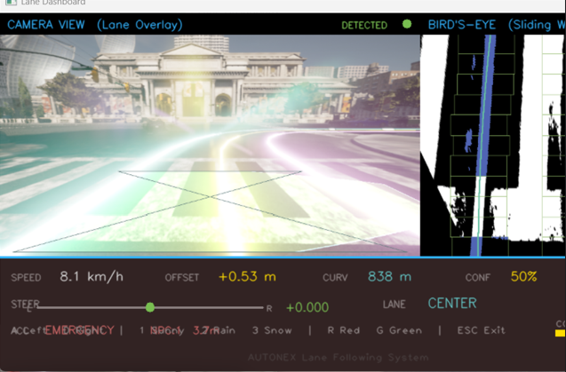
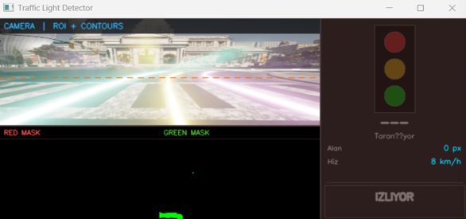
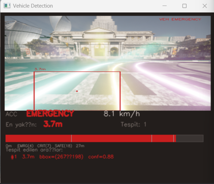
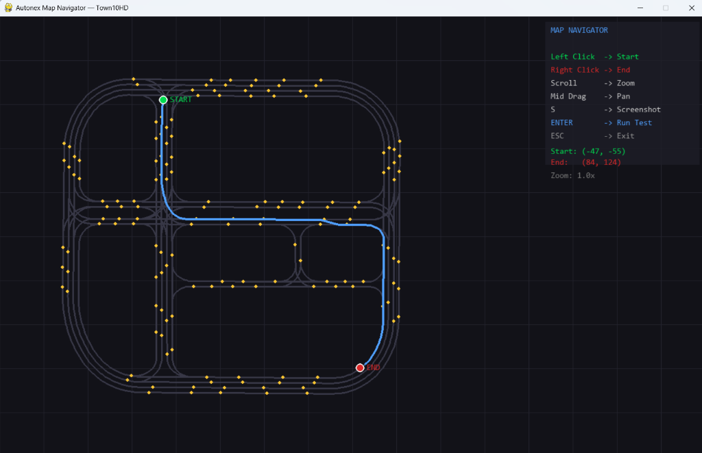
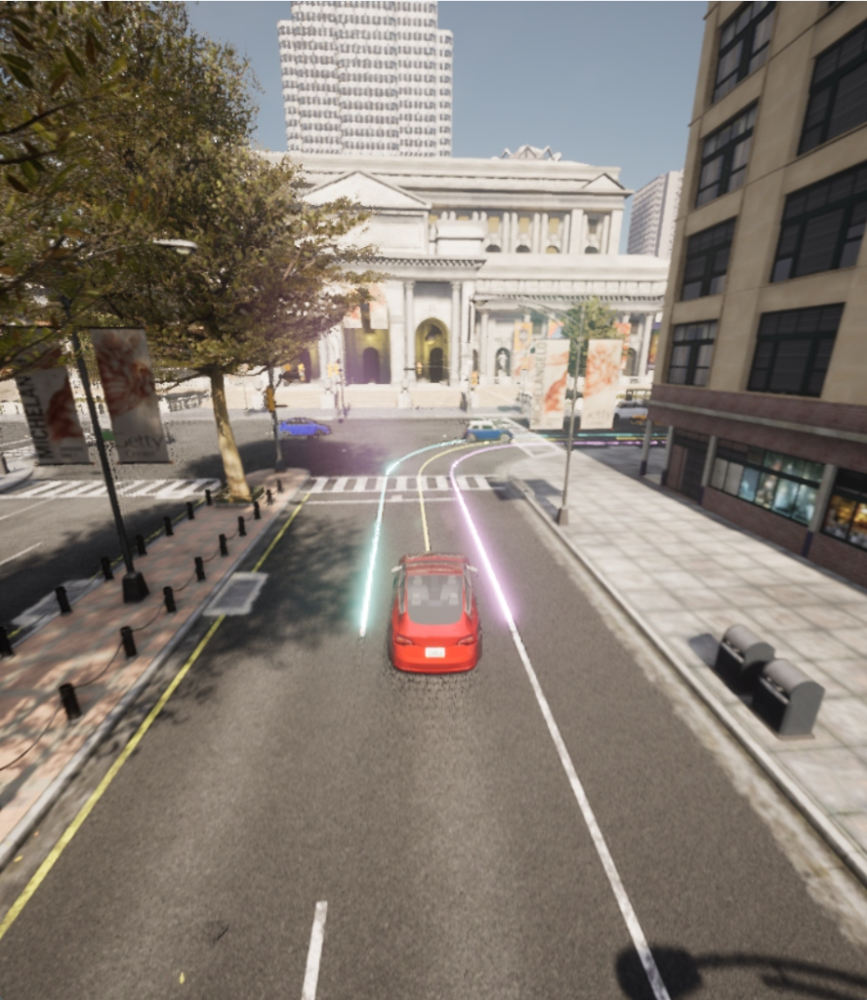

<p align="center">
  
  
  
  
  
</p>

<h1 align="center">🚗 Autonex</h1>
<h3 align="center">Vision-Based Autonomous Driving Simulation</h3>

<p align="center">
  <i>Tamamen bilgisayarla görü (Computer Vision) ile çalışan, gerçek zamanlı otonom sürüş simülasyonu.</i><br/>
  <i>CARLA Simulator üzerinde şerit takibi, trafik ışığı tanıma ve adaptif hız sabitleme.</i>
</p>

<br/>

<!-- ══════════════════════════════════════════════════════════════════
     📸 ANA EKRAN GÖRÜNTÜLERİ
     Aşağıdaki yorum satırlarındaki placeholder'ları kendi ekran
     görüntülerinizle değiştirin. Dosyaları screenshots/ klasörüne
     koyup yolunu güncelleyin.
     ══════════════════════════════════════════════════════════════════ -->

<p align="center">
  
  <br/><i>Tam simülasyon görünümü — MiniMap, Şerit Kamerası, Trafik Işığı ve Araç Tespit panelleri</i>
</p>

---

## 📌 Proje Hakkında

**Autonex**, CARLA Simulator ve Python kullanılarak geliştirilen ileri düzey bir otonom sürüş simülasyonudur. Projenin temel amacı, karmaşık kentsel ortamlarda bir aracı **tamamen gerçek zamanlı bilgisayarla görü ve görüntü işleme teknikleri** ile güvenli ve yasal şekilde yönlendirmektir.

> **Hiçbir derin öğrenme modeli veya önceden eğitilmiş ağ kullanılmamıştır.**  
> Tüm algılama, klasik OpenCV algoritmaları (HSV renk uzayı, Canny kenar tespiti, Hough dönüşümü, kontur analizi, perspektif warp) ile yapılmaktadır.

---

## 🚀 Temel Özellikler

### 🛣️ Gerçek Zamanlı Şerit Takibi
Ön RGB kameradan alınan görüntülere uygulanan pipeline:

| Adım | Teknik | Açıklama |
|:----:|--------|----------|
| 1 | **HLS Renk Filtresi** | Beyaz ve sarı şerit çizgilerinin ayrıştırılması |
| 2 | **Canny Edge Detection** | Kenar tespiti ile şerit sınırlarının belirlenmesi |
| 3 | **Perspective Warp** | Kuşbakışı (bird's-eye) görünüme dönüşüm |
| 4 | **Sliding Window** | Histogram tabanlı kayan pencere ile şerit piksellerinin tespiti |
| 5 | **2. Derece Polinom Fit** | Şerit eğrisinin matematiksel modellenmesi |
| 6 | **PID Kontrol** | Lateral offset ve eğrilik bazlı direksiyon kontrolü |

<p align="center">
  
  <br/><i>Lane Dashboard — Camera Overlay + Bird's-Eye Warped görünüm ile şerit tespiti</i>
</p>

### 🚦 Trafik Işığı Tanıma
Kamera tabanlı, tamamen OpenCV HSV renk analizi ile çalışır:

- **Çift HSV Aralığı:** Kırmızı rengin 0°/180° sarmalanmasına uygun çift maske
- **Kontur Analizi:** Alan, dairesellik, aspect ratio ve extent filtreleri
- **Koyu Gövde Kontrolü:** Trafik ışığı kasası doğrulaması (false positive azaltma)
- **Çoklu Frame Doğrulama:** Ardışık 3+ frame'de tespit → onaylı durdurma kararı
- **CARLA World Validation:** Kamera tespiti + dünya verisi çapraz doğrulama

<p align="center">
  
  <br/><i>Traffic Light Detector — HSV renk maskeleri ve kontur analizi ile trafik ışığı tespiti</i>
</p>

### 🚙 OpenCV Araç Tespiti & Adaptif Hız Sabitleme (ACC)
Ön kamera görüntüsünden diğer araçları tespit edip mesafe tahmini yapar:

- **Canny + Background Subtraction** ile hareket eden nesnelerin tespiti
- **Perspektif geometri** ile piksel genişliğinden metre cinsinden mesafe hesaplama
- **4 durumlu FSM:** `FREE_DRIVE → FOLLOWING → BRAKING → EMERGENCY`
- **EMA yumuşatma** ile ani gaz/fren geçişlerinin önlenmesi

<p align="center">
  
  <br/><i>Vehicle Detection — Bounding box ile araç tespiti ve ACC mesafe kontrolü</i>
</p>

### 🗺️ İnteraktif Harita Navigasyonu
Pygame tabanlı kuşbakışı harita navigatörü:

- **Sol tık** → Başlangıç noktası seçimi (yola snap)
- **Sağ tık** → Bitiş noktası seçimi (yola snap)
- **Scroll** → Yakınlaştırma / uzaklaştırma
- **Orta tık sürükleme** → Haritayı kaydırma
- **ENTER** → Rota hesapla ve simülasyonu başlat
- **GlobalRoutePlanner** ile otomatik rota oluşturma

<p align="center">
  
  <br/><i>İnteraktif Harita Navigatörü — Town10HD üzerinde rota seçimi</i>
</p>

### 🔧 Ek Yetenekler

| Özellik | Açıklama |
|---------|----------|
| **NPC Trafik** | 100 adet otonom NPC araç ile yoğun trafik ortamı |
| **Şerit Değiştirme** | `A/D` veya `←/→` tuşlarıyla manuel şerit değiştirme |
| **Hava Durumu** | `1/2/3` tuşlarıyla güneşli / yağmurlu / karlı hava değişimi |
| **Çoklu Kamera** | DroneCam, ChaseCam ve MiniMap eş zamanlı görüntüleme |
| **Stall Recovery** | 5 saniyelik hareketsizlikte otomatik kurtarma mekanizması |
| **Yeşil Rota Çizgisi** | Waypoint rotasının dünya üzerinde gerçek zamanlı çizimi |

---

## 🛠️ Sistem Mimarisi

Proje **MVC (Model-View-Controller)** tasarım deseni ile üç katmanlı modüler mimari kullanır:

```
┌─────────────────────────────────────────────────────────────────────┐
│                          main.py (Entry Point)                      │
│             Mod seçimi: --map / --lane / default                    │
└────────┬──────────────────────┬──────────────────────┬──────────────┘
         │                      │                      │
    ┌────▼──────┐         ┌─────▼─────┐         ┌─────▼──────┐
    │  MODELS   │         │   VIEWS   │         │ CONTROLLERS│
    │ (Algılama)│         │ (Görsel)  │         │  (Kontrol) │
    └───────────┘         └───────────┘         └────────────┘

 ╔═══════════════╗    ╔════════════════════╗    ╔═══════════════════╗
 ║  lane_detector ║    ║  lane_dashboard    ║    ║  simulation       ║
 ║  vehicle_det.  ║    ║  traffic_light_p.  ║    ║  lane_controller  ║
 ║  route         ║    ║  vehicle_det_panel ║    ║  traffic_light_c. ║
 ║  connection    ║    ║  map_navigator     ║    ║  acc_controller   ║
 ║  vehicle       ║    ║  minimap           ║    ║  traffic_rules_e. ║
 ║  traffic       ║    ║  chase_cam         ║    ║  vehicle_ctrl.    ║
 ║  npc_manager   ║    ║  drone_cam         ║    ╚═══════════════════╝
 ╚═══════════════╝    ║  lane_camera       ║
                      ║  spectator         ║
                      ╚════════════════════╝
```

### Algılama Pipeline'ları

```
Ön Kamera (640×480, FOV 110°)
       │
       ├──▶ LaneDetector ──▶ HLS → Canny → Warp → Sliding Window → Polinom Fit
       │                         └──▶ lateral_offset_m, curvature_m, confidence
       │
       ├──▶ TrafficLightDetector ──▶ HSV Maskeleme → Kontur → Dairesellik Filtre
       │                                └──▶ state (red/green/none), should_stop
       │
       └──▶ VehicleDetector ──▶ Canny + MOG2 → Kontur → Perspektif Mesafe
                                    └──▶ closest_distance_m, vehicle_count
                                              │
                                    ┌─────────▼──────────┐
                                    │  TrafficRulesEngine │
                                    │  (Karar Birleştirme)│
                                    └─────────┬──────────┘
                                              │
                                    ┌─────────▼──────────┐
                                    │   AccController    │
                                    │  (FSM: FREE→EMERG) │
                                    └────────────────────┘
```

---

## 📂 Dosya Yapısı

```
Autonex/
├── main.py                          # Ana giriş noktası ve mod yönetimi
├── config.py                        # Tüm sabitler ve parametreler
│
├── models/                          # 🧠 Algılama & Veri Katmanı
│   ├── lane_detector.py             #    Şerit tespit pipeline (OpenCV)
│   ├── vehicle_detector.py          #    Araç tespit & mesafe tahmini
│   ├── route.py                     #    Rota planlama (GlobalRoutePlanner)
│   ├── connection.py                #    CARLA sunucu bağlantı yönetimi
│   ├── vehicle.py                   #    Ego araç spawn & fizik
│   ├── traffic.py                   #    NPC trafik yönetimi
│   └── npc_manager.py              #    NPC araç yaşam döngüsü
│
├── views/                           # 🖥️ Görselleştirme Katmanı
│   ├── lane_dashboard.py            #    Şerit tespit dashboard paneli
│   ├── traffic_light_panel.py       #    Trafik ışığı debug paneli
│   ├── vehicle_detection_panel.py   #    Araç tespit overlay paneli
│   ├── map_navigator.py             #    İnteraktif harita navigatörü
│   ├── minimap.py                   #    Gerçek zamanlı minimap
│   ├── chase_cam.py                 #    3. şahıs takip kamerası
│   ├── drone_cam.py                 #    Kuşbakışı drone kamerası
│   ├── lane_camera.py               #    Ön kamera sensör yönetimi
│   ├── lane_cam.py                  #    Şerit kamera penceresi
│   ├── spectator.py                 #    CARLA spectator kontrolü
│   └── green_line.py                #    Rota çizgisi çizimi
│
├── controllers/                     # 🎮 Kontrol & Karar Katmanı
│   ├── simulation.py                #    Ana simülasyon döngüsü (orchestrator)
│   ├── lane_controller.py           #    PID şerit takip kontrolcüsü
│   ├── traffic_light_controller.py  #    Kamera trafik ışığı tespiti
│   ├── acc_controller.py            #    Adaptif Hız Sabitleme (ACC)
│   ├── traffic_rules_engine.py      #    Trafik kuralları karar motoru
│   └── vehicle_controller.py        #    Waypoint PID kontrolcüsü
│
└── utils/                           # 🔧 Yardımcı Araçlar
    └── logger.py                    #    Formatlı konsol logger
```

---

## ⚙️ Çalıştırma Modları

```bash
# 1. Varsayılan Rota — Sabit başlangıç/bitiş noktaları ile waypoint PID
python main.py

# 2. Harita Navigatörü — İnteraktif rota seçimi
python main.py --map

# 3. Şerit Takibi — Kamera tabanlı otonom sürüş
python main.py --lane

# 4. Harita + Şerit — İnteraktif rota seçimi + kamera şerit takibi
python main.py --map --lane
```

### Kontrol Tuşları (Simülasyon İçi)

| Tuş | İşlev |
|:---:|-------|
| `A` / `←` | Sola şerit değiştir |
| `D` / `→` | Sağa şerit değiştir |
| `1` | ☀️ Güneşli hava |
| `2` | 🌧️ Yağmurlu hava |
| `3` | ❄️ Karlı hava |
| `R` | 🔴 Trafik ışığını kırmızıya zorla |
| `G` | 🟢 Trafik ışığını yeşile zorla |

---

## 🖥️ Çoklu Pencere Düzeni

```
┌──────────┐ ┌──────────────────┐ ┌──────────────────┐
│ MiniMap  │ │    DroneCam      │ │    ChaseCam      │
│ 320×320  │ │    780×500       │ │    780×500       │
│          │ │                  │ │                  │
└──────────┘ └──────────────────┘ └──────────────────┘
┌──────────────────────────┐ ┌──────────────────────────┐
│   Traffic Light Panel    │ │  Vehicle Detection Panel │
│                          │ │                          │
└──────────────────────────┘ └──────────────────────────┘
              ┌──────────────────────────┐
              │     Lane Dashboard       │
              │  (Warped + Overlay)      │
              └──────────────────────────┘
```

---

## 💻 Teknoloji Yığını

| Kategori | Teknoloji | Kullanım Amacı |
|----------|-----------|----------------|
| **Simülasyon** | CARLA 0.9.16 | Gerçekçi kentsel sürüş ortamı (Town10HD) |
| **Programlama** | Python 3.12 | Tüm uygulama mantığı |
| **Görüntü İşleme** | OpenCV 4.x | Şerit, trafik ışığı ve araç tespiti |
| **Bilimsel Hesaplama** | NumPy | Matris işlemleri, polinom fit, perspektif dönüşüm |
| **GUI / Harita** | Pygame | İnteraktif harita navigatörü ve kamera pencereleri |

---

## 🔧 Kurulum

### Gereksinimler
- CARLA Simulator 0.9.16
- Python 3.12+
- Aşağıdaki Python paketleri:

```bash
pip install opencv-python numpy pygame
```

### CARLA Bağlantısı
`config.py` dosyasında CARLA PythonAPI yolunu güncelleyin:

```python
CARLA_AGENTS = r"C:\<CARLA_INSTALL_PATH>\PythonAPI\carla"
```

### Çalıştırma
1. CARLA Simulator'ü başlatın
2. Aşağıdaki komutlardan birini çalıştırın:

```bash
python main.py --map --lane
```

---

## 📸 Ekran Görüntüleri

<p align="center">
  
  <br/><i>🗺️ İnteraktif Harita Navigatörü — Town10HD haritasında başlangıç ve bitiş noktası seçimi ile otomatik rota oluşturma</i>
</p>

<p align="center">
  
  <br/><i>🚗 Tam Simülasyon Görünümü — MiniMap, Lane Camera, Traffic Light Detector ve Vehicle Detection panelleri eş zamanlı çalışırken</i>
</p>

<p align="center">
  
  <br/><i>🎥 ChaseCam Görünümü — 3. şahıs takip kamerası ile otonom sürüş ve rota çizgisi</i>
</p>

---

## 👥 Ekip

Erciyes Üniversitesi Yazılım Mühendisliği proje takımı tarafından geliştirilmiştir.

| İsim | Rol |
|------|-----|
| **Furkan Zorlu** | Geliştirici |
| **Erdem Develioğlu** | Geliştirici |
| **Abdullah Karaismailoğlu** | Geliştirici |

---

<p align="center">
  <sub>Erciyes Üniversitesi — Yazılım Mühendisliği — 2025</sub>
</p>
